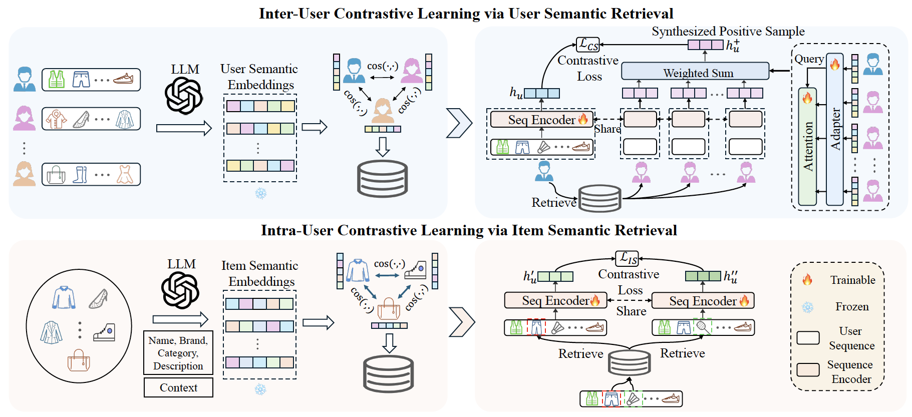

<div align=center>
<h1><a color="red" href="https://arxiv.org/abs/2503.04162">[NeurIPS 2025] SRA-CL: Semantic Retrieval Augmented Contrastive Learning for Sequential Recommendation</a></h1>
</div> 



<h4 align="center">Overview of SRA-CL.</h4>

## Environment Dependencies
This project uses the following versions of Python and Torch:

- **Python**: 3.8.19
- **Torch**: 1.13.0+cu117

For a more detailed list of dependencies, please refer to the `requirements.txt` file.

## Running SRA-CL

Follow the steps below to run the Semantic Retrieval Augmented Contrastive Learning (SRA-CL):

### 1. Build Datasets and Generate Prompts.

```bash
cd build_datasets&prompts

# Replace <dataset> with the name of the selected dataset
jupyter notebook <dataset_name>.ipynb 
```

### 2. Use LLM API to generate text descriptions and then obtain semantic embeddings.

```bash
cd get_llmResponse&semanticEmb

# Obtain LLM's description for items
python obtain_response_item.py

# Obtain LLM's description for users
python obtain_response_user.py

# Transform items' textual descriptions into embeddings
python obtain_text_emb_item.py

# Transform users' textual descriptions into embeddings
python obtain_text_emb_user.py
```

### 3. Train recommender models.
```bash
cd recommender_code
sh train.sh
```
